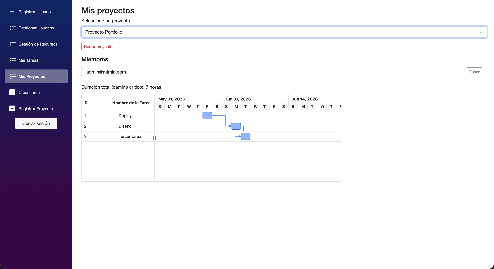

# TaskTrackPro

**TaskTrackPro** es una aplicación web de gestión de proyectos y tareas construida con **.NET 8 / Blazor Server**. Permite a un equipo organizar proyectos, crear tareas con dependencias, asignar usuarios y recursos, calcular el **camino crítico** del proyecto y visualizarlo en un **diagrama de Gantt**.

Nació como proyecto de la materia **Diseño de Aplicaciones 1 (Universidad ORT Uruguay)** y se completó aplicando **TDD, arquitectura en capas, GitFlow e integración continua**.

## Estado del proyecto

**Terminado y funcional.** Se verificaron de punta a punta todas las funcionalidades: login y roles, creación/borrado de proyectos y tareas, dependencias con bloqueo y desbloqueo automático, cálculo de camino crítico, gestión de recursos con detección de sobreasignación y exportación. Cuenta con **161 pruebas automatizadas en verde** e integración continua en GitHub Actions.

## Características

- **Usuarios y roles**: registro, login (contraseñas hasheadas con BCrypt) y roles con permisos por flags (Miembro de proyecto, Líder de proyecto, Administrador de proyecto, Administrador de sistema).
- **Proyectos**: crear proyectos, administrar miembros (agregar / quitar), editar y eliminar.
- **Tareas**: crear tareas con descripción, duración, fecha de inicio y estado (Pendiente / Bloqueada / Completada). Eliminar tareas.
- **Dependencias entre tareas**: una tarea puede depender de otras; al agregar una dependencia la tarea se bloquea automáticamente y se desbloquea cuando sus dependencias se completan. Se previenen las dependencias cíclicas.
- **Camino crítico (CPM)**: cálculo de la duración total del proyecto y de las tareas críticas (holgura cero) a partir de duraciones y dependencias. Se muestra en el Gantt y en los exportadores.
- **Gestión de recursos**: recursos globales (humano, material, etc.) con una capacidad; se asignan a tareas y el sistema **detecta sobreasignación** (no permite usar un recurso en más tareas activas que su capacidad).
- **Diagrama de Gantt** (Syncfusion) con dependencias y marcado de tareas críticas.
- **Exportación** de proyectos a **CSV** y **JSON** (incluye flag de camino crítico y recursos por tarea).

## Tecnologías

- C# / .NET 8
- ASP.NET Core Blazor Server (render interactivo en servidor)
- Entity Framework Core 8 (SQL Server / Azure SQL Edge)
- Syncfusion Blazor (Gantt)
- BCrypt.Net (hash de contraseñas)
- MSTest + Moq (testing)
- Docker / docker-compose (base de datos)
- GitHub Actions (CI)

## Arquitectura

Arquitectura en capas, con dependencias hacia adentro:

```
FrontEnd (Blazor)  ->  Servicios  ->  DataAccess (repos + EF Core)  ->  Dominio
        \                  \                                              /
         \------------------\------------- Dtos --------------------------
```

- **Dominio**: entidades con su lógica de negocio y validaciones (Usuario, Proyecto, Tarea, Recurso, Rol) y la `CalculadoraCaminoCritico`.
- **DataAccess**: `SqlContext` (EF Core) y repositorios.
- **Servicios**: casos de uso y orquestación (incluye la sesión de usuario y la detección de sobreasignación de recursos).
- **Dtos**: objetos de transferencia entre capas.
- **FrontEnd**: páginas Blazor.

**Nota técnica (limitación conocida):** la sesión de usuario y el `DbContext` viven a nivel del circuito de Blazor Server (scoped por conexión). Es un patrón simple y suficiente para esta app; una evolución natural sería usar `IDbContextFactory` con contextos por operación y autenticación basada en `AuthenticationStateProvider`.

## Cómo ejecutar

**Requisitos:** Docker Desktop y .NET 8 SDK.

1. Levantar la base de datos (SQL Server / Azure SQL Edge) en Docker:
   ```bash
   docker compose up -d
   ```
   Expone SQL en `localhost:1433` (usuario `sa`, contraseña `Passw1rd`, definidos en `docker-compose.yml`).

2. Ejecutar la aplicación:
   ```bash
   dotnet run --project FrontEnd
   ```
   La primera ejecución aplica automáticamente las migraciones de EF Core. Abrir: **http://localhost:5163**

3. Iniciar sesión con el usuario administrador semilla:
   - **Email:** `admin@admin.com`
   - **Contraseña:** `Admin123@`

4. Apagar la base de datos cuando termines:
   ```bash
   docker compose down
   ```

## Ejecutar los tests

```bash
dotnet test
```

El proyecto se construyó siguiendo **TDD** (🟥 Red → 🟩 Green → ♻️ Refactor), con suites por capa:
`DominioTests`, `DataAccessTest` y `ServicesTests`. La CI de GitHub Actions corre los tests en cada push/PR.

## Configuración y seguridad

`FrontEnd/appsettings.json` contiene la cadena de conexión y la license key de Syncfusion **como valores por defecto de desarrollo local** (la base es un contenedor descartable). La key de Syncfusion se lee desde configuración (`Syncfusion:LicenseKey`), no está hardcodeada en el código.

Para un repositorio público o un entorno productivo, conviene moverlos a *user-secrets* o variables de entorno y no commitearlos:

```bash
dotnet user-secrets set "ConnectionStrings:DefaultConnection" "<tu-cadena>" --project FrontEnd
dotnet user-secrets set "Syncfusion:LicenseKey" "<tu-key>" --project FrontEnd
```

La license key de Syncfusion es de tipo **Community** (gratuita). Si vas a publicar el repo, generá la tuya en el portal de Syncfusion y, si la anterior quedó expuesta en el historial de git, rotala.

## Capturas

### Diagrama de Gantt con camino crítico

Vista de un proyecto: el diagrama de Gantt muestra las dependencias entre tareas (flechas), las tareas críticas y la duración total del proyecto calculada por el método del camino crítico (CPM).



## Autores

Proyecto del curso Diseño de Aplicaciones 1 - Universidad ORT Uruguay.

- Gonzalo Cabrera
